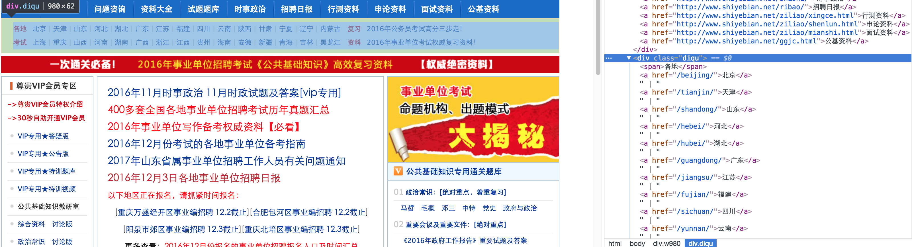
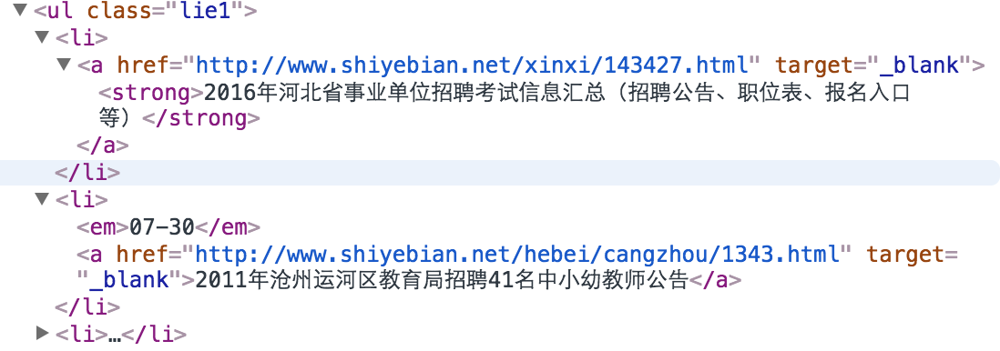
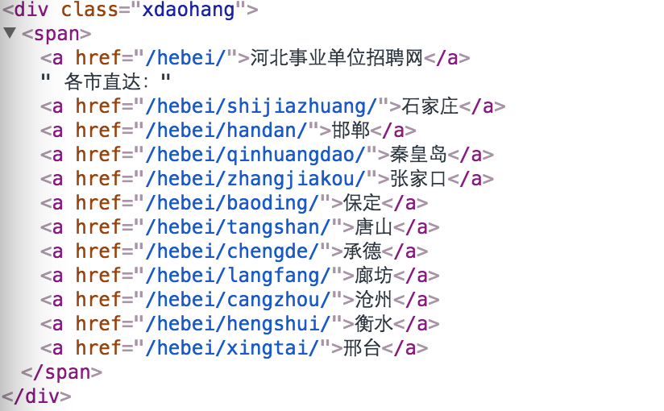
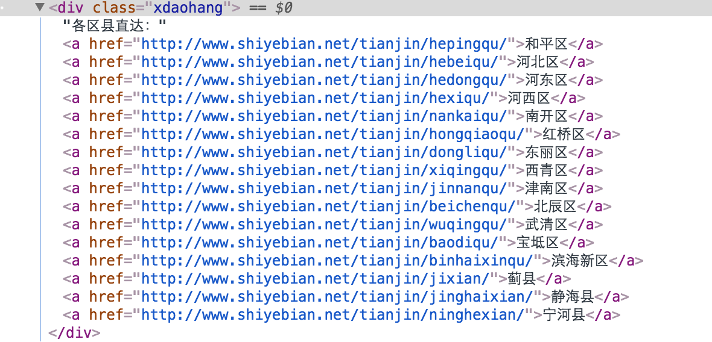
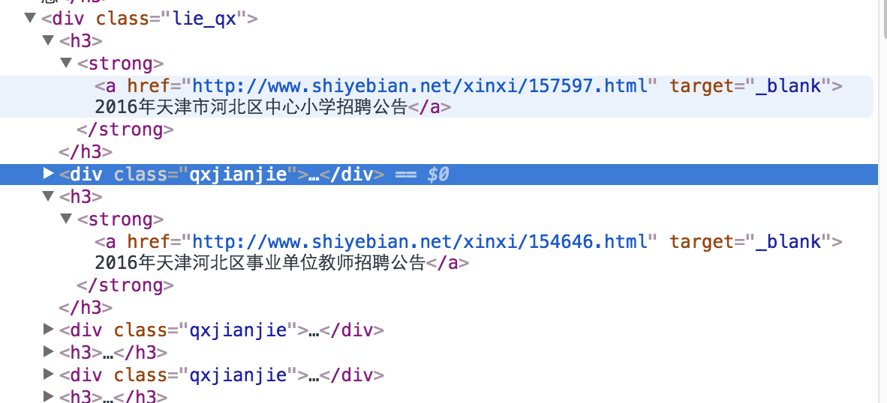

# mFlaskProject

2016/12/4
重新爬- -
## 页面分析

1.首页或其他页面可以爬到省份信息:

    http://www.shiyebian.net/
    

    

    <a href="/beijing/">北京</a>
2.地区页面就可以爬到整个省招聘的信息：

    http://www.shiyebian.net/hebei/
1）数据存在无序列表里:

    

    <ul class="lie1">
    <li>
    <a href ="招聘信息url"
    </li>
汇总条目带<strong>标签

2）翻页：

    /地区 或/地区/index.html 为首页
    /地区/index_页数.html 位置后页面
html标签如下:

    

    <a href="下n页url">第n页</a>
3.选择市：

    

 
如果是直辖市则显示:
 
4.具体区县页面（貌似没有翻页）:

    

   
    
##思路分析

实际爬去的内容分为两种：

    1.省市的全部招聘信息 exp:
        http://www.shiyebian.net/hebei/
        http://www.shiyebian.net/hebei/shijiazhuang/
    2.区县的全部招聘信息 exp:
        http://www.shiyebian.net/hebei/shijiazhuangqiaodongqu/
        http://www.shiyebian.net/beijing/dongchengqu/
先request获取网页内容：

    def download_html(url):
    headers = {
        'User-Agent': 'Mozilla/5.0 (Macintosh; Intel Mac OS X 10_11_2) AppleWebKit/537.36 (KHTML, like Gecko) Chrome/47.0.2526.80 Safari/537.36'
    }
    try:
        r = requests.get(url, headers)
        if r.ok:
            html = r.content
            return BeautifulSoup(html, 'html.parser')
        else:
            raise RequestException('url:'+str(url)+',status code:'+r.status_code)
    except requests.RequestException as e:
        raise RequestException(e)
然后爬去省份信息：

    #返回一个[{"province":xxx,"href":xxx},xxx]的数列，方便直接构造json数据
    def get_list_province(soup):
        province_list = []
        diqu = soup.find('div', attrs={'class', 'diqu'})
        for a in diqu.find_all('a'):
            province ={}
            province['province'] = a.getText()
            province['href'] = a['href']
            province_list.append(province)
        return province_list
爬去全省市的招聘信息：

    def parse_shengshi(soup, keyword=''):
        lie1 = soup.find('ul', attrs={'class', 'lie1'})
                    my_list = []
        for li in lie1.find_all('li'):
            content = li.getText()
            if keyword in content:
                my_dict = {}
                content_url = li.find('a')['href']
                my_dict['title'] = content
                my_dict['url'] = content_url
                my_list.append(my_dict)
        return my_list

爬取区县招聘信息：

    def parse_quxian(soup, keyword=''):
        lie_qx = soup.find('div', attrs={'class', 'lie_qx'})
        my_list = []
        for a in lie_qx.find_all('a'):
            content = a.getText()
            if not '查看详情' in content:
                if keyword in content:
                    href = a['href']
                    my_dict = {}
                    my_dict['title'] = content
                    my_dict['url'] = href
                    my_list.append(my_dict)
        return my_list